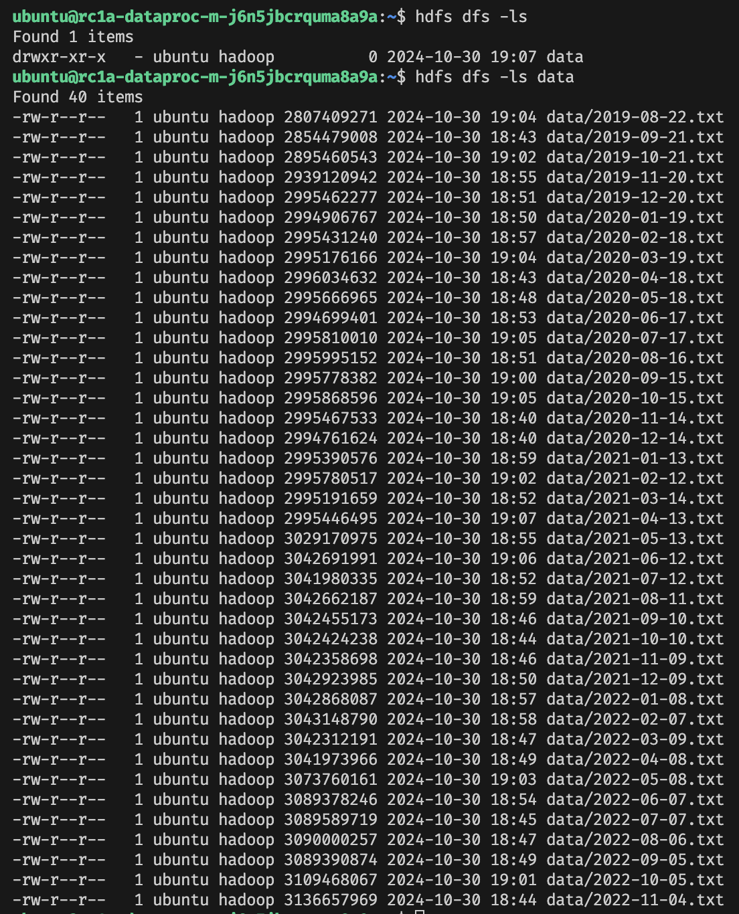

# Практика для урока 12

1. Для разворачивания инфраструктуры проекта необходимо заполнить файл с секретами ***secrets.tfvars***, который находится в директории проекта. В файле нужно указать следующие параметры
- yc_cloud_id
- yc_folder_id
- yc_token

2. После заполнения файла ***secrets.tfvars*** необходимо выполнить команду ```terraform init``` для инициализации инфраструктуры
3. Для создания необходимых ресурсов в Yandex Cloud необходимо выполнить команду ```terraform apply -vars-file=secrets.tfvars```

Рузультатом выполнения команды будет копирование файла из S3 в Hadoop:

